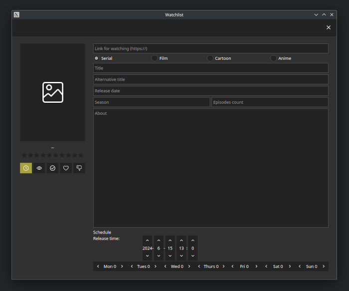
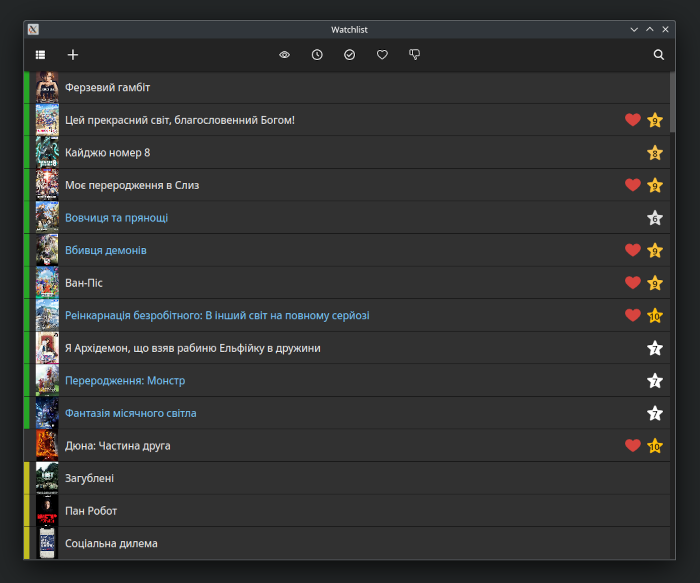

# Watchlist

Application for keeping your list of watched shows or those you plan to watch.

## About

Currently, many sites exist where you can watch different shows. However, sometimes you need one list for all of them in one place, and it would be good to have a schedule for catching new episodes. This application aims to do that. For now, it can get show information from the site IMDB, but later, other sites may be added.

## Usage

To build and run the application, download [rustup](https://rustup.rs). Then run the command:

```bash
cargo run --release
```

After this, you can find the app binary in this path `target/release/watchlist` directory.

The main window displays your list of shows:


To add a new show, press the  button.

Add window:



To import show information, input the link of the site and press the  button


Here is the imported show:


To change the show's poster, click on the image and choose a file from disk or paste link of a remote image.


Here is the changed show's poster:


Here is the view after adding a show:


The show window:


You can change the show's rating and status:


You can also change the view of the watchlist. Just press the  button:



If, when adding a show, you set the release date and time, as well as the day of the week for episode releases and their number, the application can determine if new episodes are available. If so, the show's name in the list will be blue.

You can search for a show by pressing the  button, and start typing the show's name:


